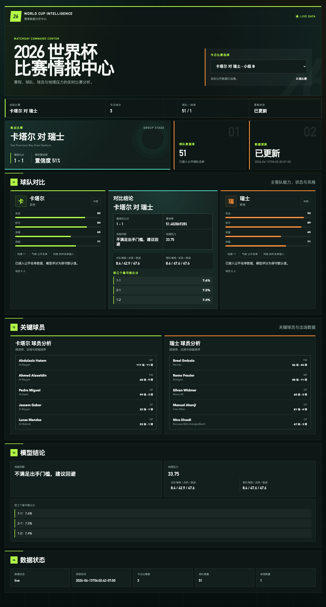

# worldCup

面向 2026 FIFA World Cup 的 Python 实时数据、比赛分析与 AI 接入项目。项目提供专业体育 Dashboard、结构化 REST API，以及可直接交给大模型消费的上下文接口。

## 功能

- 聚合公开世界杯赛程、球队名单和官方赛事页面
- 今日比赛切换，联动更新球队、球员、比分和地理压力分析
- 基于公开名单数据生成比分概率分布
- 提供适合 AI Agent 使用的 `/api/ai-context`
- FastAPI 单服务运行，不依赖 Docker
- 桌面端与移动端响应式 Dashboard

## 页面截图



说明：截图对应公开版界面，已去除内部调试与状态快捷入口。

## 快速启动

要求 Python 3.11 或更高版本。

```bash
git clone <your-repository-url>
cd worldCup

python3 -m venv .venv
source .venv/bin/activate
pip install -r requirements.txt

PORT=8003 python app.py
```

打开：

- Dashboard: `http://127.0.0.1:8003/`

说明：公开仓库文档已做脱敏处理，内部调试与状态查看入口不在 README 中直接暴露。

公开说明口径：
- 仓库仅展示可公开的运行方式与产品能力
- 内部状态页、今日数据页、AI 调试入口按部署环境自行配置
- 准备发 GitHub 的版本默认视为已完成必要脱敏

也可以安装为 Python 命令：

```bash
pip install .
PORT=8003 worldCup
```

## API

### AI 上下文

```bash
curl http://127.0.0.1:8003/api/ai-context
```

返回赛程、球队、球员、场馆、预测结果和可供模型直接使用的提示上下文。

### 指定比赛预测

```bash
curl "http://127.0.0.1:8003/api/predict?home=巴西&away=摩洛哥&venue=New%20York%20New%20Jersey%20Stadium"
```

## 数据原则

- 不使用本地虚构赛程或球员名单兜底
- 当前数据来自公开赛事页面和公开球队名单
- 数据抓取失败时只返回最近一次成功缓存或不可用状态
- 模型输出是概率分析，不代表确定赛果，也不保证任何投资收益

## 项目结构

```text
worldcup_ai/
  app.py          # FastAPI 路由和 Dashboard
  fetchers.py     # 公开数据抓取与解析
  models.py       # 数据模型
  predictor.py    # 比分和地理因素分析
  service.py      # 数据聚合与缓存
  static/         # Dashboard 样式
```
